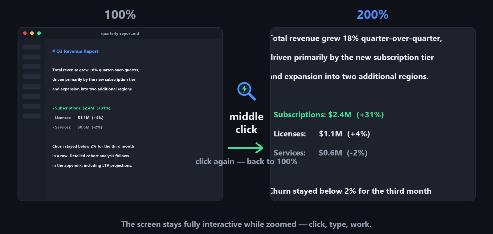
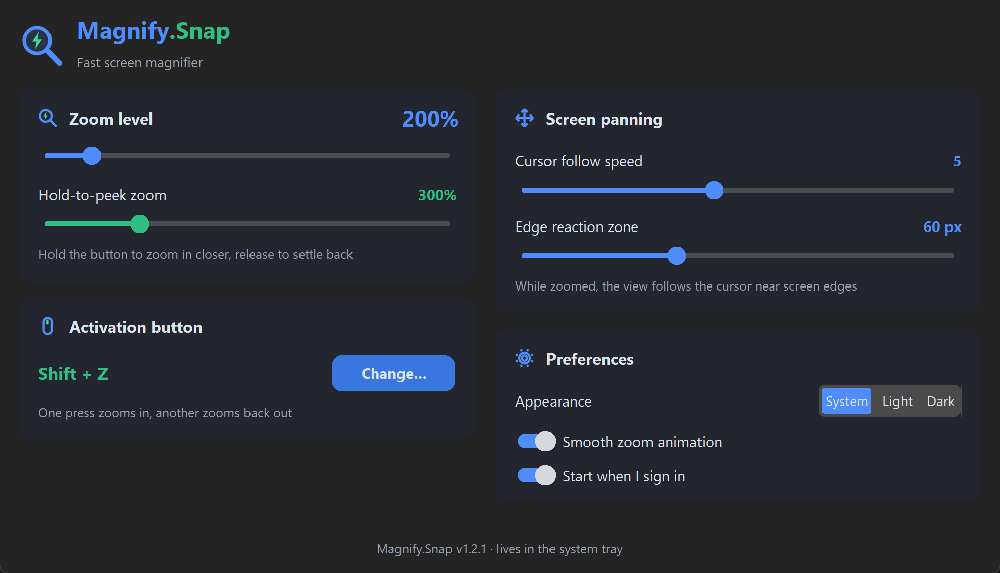

# Magnify.Snap ⚡🔍

**Click — zoom. Click — back. One mouse button is the whole interface.**

Press the middle mouse button: the screen instantly zooms to 200%.
Press it again: you're back to 100%. That's it. No keyboard chords to
remember, no toolbars, no floating widgets, no mode you have to exit.
And while zoomed, the screen stays **fully interactive** — click, type
and work as usual.

Compare that to the standard way: the built-in magnifiers want a key
combo to start, another to zoom, a third to quit, and park a toolbar on
your screen the whole time. Magnify.Snap is one flick of a finger you
already have on the mouse.

> **Why this exists.** The author needed a quick screen zoom for
> everyday work — just "look closer, then keep working". After trying
> the built-in magnifiers and a pile of third-party tools, nothing
> turned out to be truly fast and frictionless. So this app was built:
> a magnifier that gets out of your way.

<p align="center">
  <a href="https://github.com/violet2code/magnify-snap/releases/download/v1.3.0/MagnifySnap-1.3.0-windows-x64.exe"></a>
  &nbsp;
  <a href="https://github.com/violet2code/magnify-snap/releases/download/v1.3.0/MagnifySnap-1.3.0-linux-x64.tar.gz"></a>
</p>

<p align="center">
  <a href="https://violet2code.github.io/"></a>
  <a href="https://github.com/violet2code/magnify-snap/releases"></a>
</p>


## How it feels



## Settings

Everything is optional — the app works out of the box. But if you want
to tune it, the settings are one tray-click away:

<p align="center"></p>

## Features

- **Instant zoom** — press the middle mouse button (default) to magnify the
  screen to 200%; press again to snap back to 100%.
- **Hold to peek** — hold the button down to temporarily boost the zoom
  (400% by default, configurable); release it and the view settles back.
  Perfect for "let me look a bit closer for a second".
- **Cursor-follow panning** — while zoomed, the view glides smoothly when the
  cursor approaches a screen edge.
- **Fully interactive** — magnification happens at the OS compositor level
  (Windows Magnification API / GNOME magnifier / KWin Zoom), so the mouse and
  keyboard keep working normally.
- **Customizable activation** — any mouse button, key, or combination with
  Ctrl/Alt/Shift/Win. Assigned by physically pressing it.
- **Settings**: zoom level (125–800%), hold-to-peek level, cursor follow
  speed, edge zone width, smooth animation, appearance (System/Light/Dark),
  start at sign-in.
- **Smooth animation** for zoom in/out.
- **Built-in updater** — the tray notifies you when a new version is out;
  one click downloads it (SHA256-verified) and the app restarts updated.
  The daily check is a single anonymous GitHub API request and can be
  turned off in settings.
- Follows the **system theme** by default; single instance; the screen is
  always restored to 100% even on abnormal exit.

## Usage

| Action | How |
|---|---|
| Toggle the magnifier | Middle mouse button (customizable) |
| Peek even closer for a moment | Hold the button; release to settle back |
| Pan the view while zoomed | Move the cursor to a screen edge |
| Open settings | Click the tray icon → "Settings…" |
| Quit | Right-click the tray icon → "Quit" |

## Install via a package manager

**Scoop** (Windows):

```powershell
scoop bucket add violet2code https://github.com/violet2code/scoop-bucket
scoop install magnifysnap
```

**WinGet** — submission under review; once accepted:
`winget install magnifysnap`

## Run from source

```bash
pip install -r requirements.txt
python main.py
```

## Build a standalone executable

**Windows** — run `build_windows.bat`; output: `dist\MagnifySnap.exe`
(single file, no console, with icon).

**Linux** — run `./build_linux.sh`; output: `dist/magnifysnap`.

Brand assets for the website are generated into `assets/`:
`logo.png` (transparent) and `logo.svg`.

## Platform notes

**Windows** — uses the system Magnification API
(`MagSetFullscreenTransform`): hardware fullscreen zoom; edge panning and the
smooth animation are computed by the app itself at 60 FPS. The bound mouse
button or key combination is suppressed so it doesn't leak into other
applications: middle-click won't trigger autoscroll, and a bound Ctrl+Z
won't perform undo in the focused window.

**Linux / GNOME** — drives the built-in GNOME magnifier via `gsettings`
(tracking mode `push` — the view moves at the edge, exactly as required).

**Linux / KDE Plasma** — drives the KWin "Zoom" effect via `qdbus`
(the effect must be enabled in system settings).

**Wayland** — global mouse/keyboard capture is restricted by the Wayland
protocol itself; full support is guaranteed on X11. On GNOME Wayland the
built-in `Super+Alt+8` magnifier shortcut is available.

Linux system packages: `python3-tk`; the tray icon on GNOME may require the
AppIndicator extension (`gir1.2-ayatanaappindicator3`).

## Project layout

```
main.py                      — entry point, DPI awareness, single instance
fast_magnifier/
  config.py                  — settings (JSON in %APPDATA% / ~/.config)
  binding.py                 — activation binding model
  input_hook.py              — global mouse/keyboard hooks (pynput)
  magnifier_windows.py       — Windows magnifier (Magnification API, ctypes)
  magnifier_linux.py         — GNOME (gsettings) and KDE (qdbus) magnifiers
  tray_icon.py               — tray icon and menu (pystray)
  settings_ui.py             — settings window (customtkinter)
  icons.py                   — all artwork drawn in code (Pillow)
  autostart.py               — start at sign-in (registry / autostart .desktop)
```
